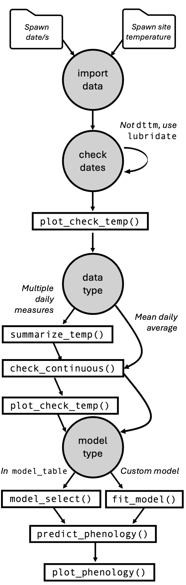

```{r setup, include=FALSE}
knitr::opts_chunk$set(echo = TRUE,
                      warning = FALSE)
```

```{r echo=FALSE, message=FALSE, warning=FALSE}
library(tidyverse); library(hatchR); library(ggdist); library(ggridges); library(patchwork)
```

# hatchR: A toolset to predict when fish hatch and emerge

Morgan M. Sparks^1,5,6^, Bryan M. Maitland^1,6^, Eli A. Felts^2^, Allison G. Swartz^3^, Paul N. Frater^4^

^1^Rocky Mountain Research Station, U.S. Forest Service, Boise, ID, USA

^2^Idaho Fish and Wildlife Conservation Office, U.S. Fish and Wildlife Service, Orofino, ID, USA

^3^College of Forestry, Oregon State University, Corvallis, OR, USA

^4^Wisconsin Department of Natural Resources, Madison, WI, USA

^5^Corresponding Author: Morgan M. Sparks, Morgan.Sparks\@usda.gov

^6^Dual first authors

keywords: developmental phenology, effective value model, R, Shiny

\newpage

# Abstract

Understanding the timing of key life history events is essential for effective fish conservation and management. Traditionally, predicting hatch and emergence timing in wild fish populations was challenging due to the reliance on average incubation temperature as a primary model parameter, which is often difficult to obtain in natural settings. Recent advancements have refined these models, enabling their application in wild environments using spawning dates and daily water temperature records. However, their broader use remains constrained by a lack of parameterizations for many species, with most applications focused on salmonids. Here we introduce **hatchR**, a software ecosystem designed to predict hatch and emergence timing for a wide range of wild fishes, requiring only spawning date and water temperature data. **hatchR** offers users access to established phenological models and the flexibility to incorporate custom parameterizations using external datasets. The software is available in two formats: an open-source R package for advanced customization and an HTML-based graphical user interface for those unfamiliar with scripting. To illustrate its utility, we present two case studies demonstrating its application in research and management. By expanding access to predictive modeling tools, **hatchR** has the potential to advance studies of fish early life history and support conservation and management efforts across diverse species.

\newpage

# Introduction

As poikilothermic organisms, fish have developmental rates that are strongly influenced by ambient environmental conditions. This close relationship has allowed researchers to develop statistical models that predict developmental phenology with high accuracy. Historically, these models were created in aquaculture settings under the assumption of constant temperatures throughout development [@beacham1990; @mcphail1979; @alderdice1978]. As a result, accumulated thermal unit thresholds (*i.e.*, ATU models) have become widely used to predict development in wild populations. However, this approach can be inaccurate, particularly at the cold and warm extremes of temperature ranges, due to the non-linear relationship between average incubation temperature and the thermal units required for development [@quinn2018].

In colder environments, fish require fewer accumulated thermal units to develop than those in warmer conditions, yet still experience longer overall developmental periods. Recognizing this non-linear relationship, @sparks2019 introduced the Effective Value model, which improves prediction accuracy by accounting for daily average temperatures following spawning. This model predicts hatch or emergence timing based on the cumulative effective values reaching a threshold of one, offering a more precise framework for forecasting developmental phenology in wild fish populations.

The effective value approach has since been widely applied to salmonids, for which aquaculture-derived parameterizations are readily available. For example, Pacific salmon (*Oncorhynchus* *spp.*) models developed by @beacham1990 have been applied across various species and populations [@adelfio2024; @adelfio2019; @kaylor2021], while Bull Trout (*Salvelinus confluentus*) models from @mcphail1979 were extended by @austin2019. Despite its growing adoption, applications of the effective value model remain largely confined to salmonids, likely due to the availability of existing parameterizations and the commercial, recreational, and cultural importance of these species.

To extend these modeling capabilities beyond salmonids and facilitate broader applications, we developed **hatchR**, a software ecosystem designed to predict hatch and emergence timing for wild fish populations. **hatchR** enables users to input standard raw or summarized water temperature datasets commonly collected in field settings, conduct basic data validation, and apply built-in parameterizations such as those from @beacham1990 or @sparks2017. Users can also develop custom models using their own or published temperature and phenological data within the effective value framework for application to unparameterized species or populations.

To maximize accessibility, **hatchR** is available in two formats. The first is an R package, **hatchR**, distributed via The Comprehensive R Archive Network (CRAN), providing advanced customization and automation for analyzing multiple variables, such as phenology type, spawn timing, or thermal regimes. Comprehensive documentation is available on the **hatchR** website (<https://bmait101.github.io/hatchR/>). The second format is a Shiny-based web application [@chang2024], offering a graphical user interface for those unfamiliar with R, balancing ease of use with much of the R package's core functionality (<https://elifelts.shinyapps.io/hatchR_demo/>). Below, we provide an overview of **hatchR** and present case studies demonstrating its application in research and management.

# **hatchR** Overview

## Workflow

The **hatchR** software is designed primarily as a tool for predicting early life history phenology in wild fishes. To maintain focus on this core function, we provide minimal built-in data validation and visualization tools, as users are expected to understand and check their own data. Given the diversity of potential data types, it is impractical to implement comprehensive validation checks. However, we include basic data-checking and summarization functions (`check_continuous()`, `summarize_temp()`) and limited built-in visualization capabilities (`plot_check_temp()`, `plot_phenology()`), the process for which is highlighted in Box 1. Intuitive functions are provided for users to apply models—either existing models from the literature using the `model_select()` function (Boxes 2,3) or fitting custom functions from data using the `fit_model()` function (Box 4). Users can then apply these models to water temperature data (*e.g.,* from an in-stream temperature logger) to predict when developmental phenology will occur using the `predict_phenology()` function (Box 2). Alternatively, if users had known or observed hatch or emergence dates, they could use `predict_spawn()` to backcalculate spawn timing using the appropriate corresponding developmental models. Finally, users can either use model output (Box 3) for custom graphics or generate simple plots using the `plot_phenology()` function which can use the output object generated from `predict_phenology()` or `predict_spawn()` (Box 5).

The software website provides user-friendly example articles that build in complexity for teaching users the functionality and flexibility of each aspect of the work flow, as well as customization for plotting model outputs. In contrast, the Shiny application includes a default output plot and an option to download results for external visualizations. For a high-level overview of **hatchR**'s applications, see Figure 1. Additional details on key functions and workflows, particularly for automating phenology predictions across multiple variables, are available on the software's webpage.

```{r, echo = FALSE, eval=FALSE, out.height= "72%", fig.align = 'center', fig.cap=""}

```

## Effective value models

Effective value models were introduced by @sparks2019 to predict developmental timing in wild fish populations, initially for Sockeye Salmon (*O. nerka*). Their development was necessitated by limitations in traditional models, such as those in @beacham1990, which relied on average incubation temperature over the full developmental period. In wild settings, estimating this average temperature was impracticable since hatch timing was unknown, even when spawning dates were recorded. To overcome this challenge, @sparks2019 reformulated model 2 from @beacham1990 by taking its reciprocal and assigning an *effective value* to each day of development based on the daily average temperature. This approach allowed for cumulative tracking of developmental progress, enabling hatch and emergence predictions without requiring prior knowledge of incubation temperatures.

The model follows the general format of:

$$
\mathrm{E_i} = \frac{1}{\exp(\log_e(a) - \log_e(T_i - b))}
$$

where $E_i$ is the effective value and $T_i$ the temperature for day $i$, and $a$ and $b$ are model parameterization estimates (i.e. species/population- or model-specific constants). A fish hatches or emerges when the cumulative sum of effective values reaches one:

$$
\sum_{i =1}^nE_i = 1
$$

To demonstrate this approach, we use European Grayling (*Thymallus thymallus*) that were raised in five experimental average temperatures ranging from 2-14 °C [@quinn2018]. We fit a developmental model to those experimental data (Figure 2A), reparameterize that model into an effective value model, and predict effective values for daily average temperatures ranging from 2-14 °C (Figure 2B).

```{r, echo = FALSE, fig.height=3, fig.align = 'center', fig.cap = ""}
grayling <- matrix(NA, 5, 2) |> tibble::tibble()
colnames(grayling) <- c("temp", "days")

grayling$temp <- c(2, 5, 8, 11, 14)
grayling$days <- c(106, 51, 29, 19, 13)

grayling_mod <- hatchR::fit_model(
  temp = grayling$temp,
  days = grayling$days,
  species = "grayling",
  development_type = "hatch"
)

temps <- c(2:14)

ef_vals <- NULL
for (x in temps) {
  ef <- eval(parse(text = grayling_mod$expression$ expression))
  ef_vals <- rbind(ef_vals, ef)
}

grayling_ef <- matrix(NA, 13, 2) |> tibble::tibble()
colnames(grayling_ef) <- c("temp", "ef")
grayling_ef$temp <- temps
grayling_ef$ef <- ef_vals[, 1]

p1 <- grayling_mod$pred_plot +
  labs(x = "Developmental average temperature (°C)", y = "Days to hatch") +
  lims(x = c(0,15)) +
  theme_classic()

data_1 <- tibble(t = c(0:14), e = seq(0, 0.14, by = 0.01))

p2 <- grayling_ef |>
  ggplot() +
  geom_point(aes(x = temp, y = ef)) +
  geom_line(aes(x = temp, y = ef)) +
  geom_line(data = data_1, aes(x = t, y = e), linetype = "dashed") +
  # geom_abline(intercept = 0, slope = .01, linetype = "dashed") +
  labs(x = "Daily average temperature (°C)", y = "Effective value") +
  lims(x = c(0,15)) +
  theme_classic()

figure_2 <- p1 + p2 + plot_annotation(tag_levels = "A")
ggsave("./manuscript_figures/Figure_2.pdf", figure_2, width = 8, height = 4, dpi = 1000)
```

This framework is the foundation for phenological models in **hatchR**. The package includes a predefined `model_table` containing established parameterizations, including those from @beacham1990, @sparks2017, and @austin2019 (who extended @mcphail1979). While `model_table` incorporates more complex models from @beacham1990, users can also fit custom models using the `fit_model()` function. This flexibility allows for the incorporation of new parameterizations as they are developed, expanding the utility of **hatchR** beyond salmonids.

## Data format

Water temperature datasets collected in the field typically fall into two categories: 1) summarized daily data, where mean daily temperatures are pre-computed, or 2) raw high-frequency data, such as those recorded by HOBO TidbiT loggers, which require summary into mean daily temperatures before use. Additionally, new statistical models that predict daily stream temperatures, such as those developed by @siegel2023, could also be implemented into this framework.

The **hatchR** software assumes input data consists of at least two required columns: a date column indicating the date (and optionally time, as is commonly the case for field loggers) of each temperature measurement, and a temperature column providing the corresponding temperature measurement (in °C). Other columns may be present, but column names should not include spaces.

The **hatchR** software will function with missing values, but gaps in the dataset may affect predictions. Since the package does not automatically handle missing data, users must check for gaps or errors before running analyses with the provided check functions (see section *Checking Data*). The **hatchR** software supports temperatures as low as 0 °C, though such values yield extremely small effective values, potentially extending hatch or emergence timing to a year or more. Users should critically assess whether such data align with biological expectations.

For R users, **hatchR** can import data in any format, provided it is converted into a `data.frame` or `tibble`, where each row represents a single temperature record. The Shiny application requires data to be uploaded as a .csv (comma separated values) file, which can easily be exported from spreadsheet software such as Microsoft Excel or Google Sheets.

## Checking Data

The **hatchR** software is designed to analyze daily average temperatures. While high-frequency data (*e.g.*, from HOBO loggers) can be used, it must be summarized into daily averages. The **hatchR** software provides built-in functionality for this summarization in R but requires pre-summarized data for use in the Shiny app.

To help users identify potential issues, **hatchR** includes basic data checking functions that highlight outliers or missing values both visually and programatically. These checks ensure data integrity before model application and are demonstrated in Box 1. Additionally, `plot_check_temp()` and `check_continuous()` are automatically run when data is loaded into the Shiny app and presented in the `Import Data` window.

Users can select from published model parameterizations contained in `model_table` (Box 2), or generate custom model parameterizations using `fit_model()` (Box 4) in both the R and Shiny deployments of **hatchR**. The models in `model_table` are included because their parameterizations are well-documented in the literature, though they are currently limited to Pacific salmon and Bull Trout (see @quinn2018 pg. 183, for additional salmonid models). To ensure reliability, we restrict `model_table` to well vetted models with experimental ranges spanning 2-17 °C, instead requiring users to carefully asses whether their own parameterized models are appropriate for the temperature ranges in their datasets.

## Fitting models for other fishes

To expand the applicability of the effective value approach beyond salmonids, **hatchR** includes a `fit_model()` function, which only requires species' development follows a power law relationship with temperature (Box 4). The function takes two input vectors: average incubation temperature (°C) and the number of days to a given phenological event. A model is then fit to the data using `stats::nls()`, which performs nonlinear least squares regression to estimate the parameters *log~e~a* and *b*. Because the optimization process in `nls()` is sensitive to initial parameter values, `fit_model()` first fits a linear model to the log-transformed data to provide initial parameter estimates, which are then used to fit the nonlinear model.

This approach allows users to generate models tailored to any species of fish, or even different populations within species, provided they have experimental or field data linking development to temperature. However, users should be mindful of several factors, such as extrapolation risks (models may not generalize beyond the temperature range for which they were parameterized) and population-specific variation (genetic differences among populations may affect developmental responses). If users design experiments for custom model fits, we recommend choosing a minimum of four treatments and choosing the coolest and warmest temperature treatments to match near thermal thresholds for the species or population for best fits. Future expansions of **hatchR** could incorporate additional vetted parameterizations for other taxa, such as non-salmonid fishes, amphibians, or invertebrates, provided sufficient validation in the literature.

# Case Study 1

**Predicting Emergence Timing for Management Actions**

A common management application of developmental phenology is assessing whether fish will be free-moving before a scheduled management action, such as stream section access for grazing or road work for culvert replacements. Such infrastructure and activities can cause sedimentation and alter fish habitat and community structure [@maitland2016] and mangers need to understand if fish will have emerged from redds before construction begins to minimize impact. This type of predictive modeling helps managers make informed, science-based decisions that balance conservation priorities with land-use activities.

In this scenario, we consider road work near the upper portion of Crooked River in the Boise River watershed in Idaho, USA, home to a key Bull Trout (*S. confluentus*) population. Bull Trout, a federally threatened species under the Endangered Species Act [@nolfi2024], are particularly sensitive to sediment disturbance. The Forest Service Fisheries Biologist overseeing the project wants to determine whether Bull Trout fry will likely be out of the gravel and free-swimming by June 1st, when work on the project will begin. In this system, Bull Trout typically complete spawning by the end of September, so we consider the latest possible spawn date as September 30th.

To demonstrate this case study, we use the **hatchR** graphical user interface. Users begin by uploading their temperature dataset through the `Import Data` window, selecting their file, specifying the appropriate temperature and date columns, and providing the date format (e.g., year-month-day or day-month-year). For this example, we use the `crooked_river` dataset, which is included in **hatchR**, which can be automatically loaded in the Shiny app's `Import Data` window.

Once uploaded, **hatchR** automatically generates a visual data check using `plot_check_temp()` and a continuous data check with `check_continuous()`. After confirming data integrity, users navigate to the `Model Phenology` window. For this case study, we use the pre-loaded Bull Trout parameterization from @austin2019, selecting the `Existing` model option via dropdown menus. The user then may chooses a single or multiple spawn dates using an interactive calendar. Here, we focus on September 30th (in the 2014 spawn year) as outlined in our management scenario.

Following model selection, **hatchR** outputs results in two key locations: the `Phenology Summaries` tab, which provides a table with predictions for each spawn date, and the `Timeline Plot` tab, which shows the corresponding visualization of development timing. Both the prediction table and plot can be downloaded directly from their respective tabs. The full process is demonstrated through a detailed walkthrough in the supplementary video file (Supplementary Materials).

```{r case-1, eval=FALSE, echo=FALSE}
# read in EFS data
EFS_data <- crooked_river

# view bull trout models and select model
model_table |>
  filter(species == "bull trout")

# we care about when fish are out of gravel, so select emerge mod
bt_emerge_mod <- model_select(
  author = "Austin et al. 2019",
  species = "bull trout",
  model = "MM",
  development_type = "emerge"
)

# predict emergence time using Sept. 30 as the spawn date
bt_emergence <- predict_phenology(
  data = EFS_data,
  dates = date,
  temperature = temp_c,
  spawn.date = "2014-09-30",
  model = bt_emerge_mod
)

# fish emerge May 1, before June 1
bt_emergence$dev_period$stop
```

In this example, the model predicts that the last Bull Trout will emerge on April 21, before the road work target date (June 1). This suggests that the Fisheries Biologist can confidently approve the work in the area without concern for sediment disturbance impacting fish developing in the gravel.

# Case Study 2

**Large Scale Predictions of Bull Trout Development Timing**

For the second case study, we demonstrate a more complex, large-scale application of **hatchR**, highlighting its full flexibility when applied programmatically in R. This example also focuses on Bull Trout, but extends beyond a single site to a broad spatial analysis across 226 locations in the greater Snake River basin in Idaho, USA.

We use the `idaho` dataset from @isaak2018, which includes four years of temperature data (2011-2014) for these sites. To identify putative Bull Trout Spawning locations, we apply a filtering criterion based on mean August temperature, as outlined in @isaak2015, selecting only sites with mean August temperature at or less than 13 °C, a known thermal threshold for Bull Trout habitat suitability. The filtering process reduced the dataset to 139 potential spawning sites. For concision, we omit the example workflow, but full details are available in the `paper.Rmd` file in the GitHub repository, or in the *Predict fish phenology: Nested* article on **hatchR**'s website.

```{r case-2-prep, echo=FALSE}
bull_trout_sites <- idaho |>
  mutate(month = month(date)) |>                # make a month column (numeric)
  filter(month == 8) |>                         # filter out Aug.
  group_by(site) |>                             # apply grouping by site
  summarise(mean_aug_temp = mean(temp_c)) |>
  filter(mean_aug_temp <= 13) |>                # keep only sites 13 C or cooler
  pull(site) |>
  unique()

# filter to bull trout sites
idaho_bt <- idaho |>
  filter(site %in% bull_trout_sites)

# nest data and summarize
isaak_summ_bt <- idaho_bt |>
  group_by(site) |>
  nest() |>
  mutate(
    summ_obj = map(
      data,
      summarize_temp,
      temperature = temp_c,
      dates = date
    )
  ) |>
  select(site, summ_obj)

# spawn dates
spawn_dates <- map(
  c(2011:2014),     # year vector to map for custom function
  function(year) {  # custom paste function
    c(
      paste0(year, "-09-01"),
      paste0(year, "-09-15"),
      paste0(year, "-09-30")
    )
  }
) |>
  unlist()

# bull trout hatch model
bt_hatch <- model_select(
  development_type = "hatch",
  author = "Austin et al. 2019",
  species = "bull trout",
  model = "MM"
)
```

To predict hatch timing across these sites, we first set up the necessary models and data, using the built-in Bull Trout parameterization. We then map `predict_phenology()` across all 139 sites, running predictions for three representative spawn dates each year (Early: September 1st, Peak: September 15th, Late: September 30th).

```{r, echo=FALSE}
# apply predict_phenology() over multiple sites and spawn dates
hatch_res <- isaak_summ_bt |>
  mutate(
    dev_period = map2(
      summ_obj,                  # summarized temperature data object
      spawn_dates,               # list of spawn dates
      predict_phenology,         # function to apply
      temperature = daily_temp,  # column of temperature data in `summ_obj`
      dates = date,              # column of date in `summ_obj`
      model = bt_hatch           # model to use (from model_select())
    ) |>
      map_df("dev_period") |>    # pull out just dev_period results
      list()
  ) |>
  select(site, dev_period) |>           # just select the columns we want
  unnest(cols = c(dev_period)) |>       # un-nest everything
  mutate(days_to_hatch = stop - start)  # make a new column of days to hatch
```

By mapping predictions across this broad spatial extent, we generate a large-scale assessment of Bull Trout phenology, illustrating how hatch timing varies across different spawning habitats. The results of this analysis are presented in Figure 3, providing insights into how hatch timing might vary under different thermal regimes and across the species' geographic range and across years. This case study underscores the power of **hatchR** for large-scale ecological applications, particularly in conservation planning and habitat suitability assessments.

```{r plot-bt, message=FALSE, echo=FALSE,  out.width='75%', fig.align='center', fig.cap=""}
cut_ints <- date(
  c(
    "2011-08-31", "2012-08-31",
    "2013-08-31", "2014-08-31",
    "2015-08-31"
  )
)

# add year and spawn time factors for plotting
hatch_factors <- hatch_res |>
  mutate(year = cut(start,
    breaks = cut_ints,
    labels = c(2011:2014)
  )) |>
  # cut coerces our labels to factors, this changes them back to numbers
  mutate(year = as.numeric(as.character(year))) |>
  mutate(day = day(start)) |>
  mutate(spawn_time = case_when(
    day == 1 ~ "Early",
    day == 15 ~ "Peak",
    day == 30 ~ "Late"
  )) |>
  mutate(spawn_time = factor(
    spawn_time,
    levels = c("Late", "Peak", "Early"),
    ordered = TRUE
  ))

hatch_factors_sum <- hatch_factors |>
  group_by(year, spawn_time, start) |>
  summarise(
    mean_hatch = ceiling(mean(days_to_hatch)),
    hatch_5 = ceiling(quantile(days_to_hatch, probs = 0.05)),
    hatch_95 = ceiling(quantile(days_to_hatch, probs = 0.95))
  )


figure_3 <- ggplot(
  data = hatch_factors,
  aes(
    x = days_to_hatch,
    y = spawn_time,
    fill = spawn_time,
    color = spawn_time
  )
) +
  geom_density_ridges(alpha = 0.9) +
  facet_wrap(~year, ncol = 1) +
  scale_fill_brewer(palette = "Blues", direction = 1) +
  scale_color_brewer(palette = "Blues", direction = 1) +
  labs(x = "Days to hatch", y = "Spawn time") +
  theme_classic() +
  theme(legend.position = "none")

ggsave("./manuscript_figures/Figure_3.pdf", figure_3, width = 3.5, height = 5, dpi = 1000)
```

# Discussion

The **hatchR** software ecosystem bridges the analytical gap in predicting developmental phenology for wild fishes. It establishes a formal framework for applying effective value models from user-provided parameterizations. The software is available in two formats: 1) A fully customizable R package, ideal for complex and repetitive analyses and 2) a graphical user interface for ease of use, designed for tasks that may only need to be run once or a few times.

Both versions allow users to import data, perform basic data checks, perform basic visualizations, and apply either pre-existing salmonid model parameterizations or generate custom models specific to other species or populations. To support users at various levels of expertise, we provide extensive documentation on the **hatchR** website (<https://bmait101.github.io/hatchR/>), covering basic and advanced applications.

## Assumptions and considerations in applying effective value models

The application of **hatchR** and the effective value modeling framework relies on several key assumptions. First, environmental stressors may alter developmental timing. While effective value models predict developmental timing based on temperature, studies have shown that stressful environmental condition such as low dissolved oxygen, altered pH, high salinity, pathogen exposure, or mechanical disturbance can induce premature hatching or emergence [@quinn2018; @cowan2024]. Users should consider how such factors may influence their predictions.

Second, developmental timing occurs as a distribution, not a fixed point. While **hatchR** provides point estimates for developmental phenology, fish spawning and development within populations occur as distributions rather than single events [@mason1976]. We encourage users to predict phenology using early, peak, and late thresholds (*e.g.*, 5th, 50th, and 95th percentiles) or incorporate real or modeled distributions to capture variation. We outline an approach for predicting phenology from a modeled distribution in our *Advanced plotting* article on the **hatchR** website (<https://bmait101.github.io/hatchR/articles/Advanced_plotting.html>).

Third, sensor-based temperature data may differ from actual embryonic ambient temperatures. Water temperatures recorded by environmental sensors may not fully reflect thermal conditions in spawning microhabitats, where geomorphic factors influence temperature regimes [@geist2002]. Users should consider how differences between measured and actual incubation temperatures may affect predictions.

## Evolutionary and population-level considerations

To date, effective value models have primarily been used to predict phenology in wild environments using species-specific parameterizations [@adelfio2024; @austin2019]. However, these models fundamentally represent reaction norms, meaning that temperature-development relationships are influenced by local adaptation, gene-environment interactions, and phylogenetic differences [@west-eberhard2003]. For example, @sparks2017 found no significant differences in developmental rates between populations in their study but did observe family-level genetic × environment interactions under different thermal regimes. Similarly, when they reparameterized their models using western Alaskan Sockeye Salmon, they found slower developmental rates compared to populations from Canada [@beacham1990], consistent with cogradient variation [@conover2009; @sparks2022]. These findings highlight the importance of considering how developmental rates are keyed to specific environments but also how these underlying statistical relationships inform micro- and macro-evolutionary processes in fishes.

## Expanding the utility of **hatchR**

The models within **hatchR** can be customized in multiple ways beyond the examples provided. While our current framework focuses on predicting hatch or emergence timing, it could be adapted to other key developmental milestones not reliant on exogenous feeding, such as early embryonic stages (*e.g.*, eye-up; [@velsen1980]), initiation or cessation of pelagic-larval dispersal, or current-mediated dispersal in riverine species, though not all cases may be as specifically tied to temperature as hatch and emergence.

Additionally, while `fit_model()` uses non-linear regression to estimate parameters, `predict_phenology()` only requires users to provide a model expression. This means that users can integrate alternative model structures, as long as they incorporate daily temperature, allowing further customization of predictions.

Finally, while **hatchR** was designed specifically for fishes, it has potential applications for other poikilothermic organisms, such as reptiles, amphibians, and invertebrates, where developmental rates similarly follow a power law relationship with temperature. Extending the effective value framework to these taxa could provide valuable insights into their life history timing under variable environmental conditions. We encourage users to submit fitted models using this framework as a pull request to **hatchR**'s Github repository provided that data used in the models are published.

# Conclusion

**hatchR** provides a versatile and accessible tool for predicting developmental phenology in wild fish populations. It offers basic data checks and summarization tools, pre-existing and customizable model parameterization options, and scalable applications from simple site-level predictions to complex multi-site analyses.

Importantly, **hatchR** extends the effective value framework developed by @sparks2019 into a generalizable tool that can be applied to any fish species or population, provided that appropriate source data are available. We present foundational applications of **hatchR**, with additional user-friendly cases and implementation guides available on the software's website. The software is designed for both applied and fundamental research, allowing users to engage with it either through a programmatic R environment or via a user-friendly Shiny app. We expect that the examples provided here represent only a fraction of **hatchR**'s potential applications and encourage the user community to explore and expand upon this framework for their own research and management needs in the face of interacting stressors in aquatic ecosystems [@craig2017].

\newpage

# Box 1: Checking and summarizing your data

To demonstrate the process of checking your data we show the workflow for the functions `summarize_temp()`, `plot_check_temp()`, and `check_continuous()` using a simulated year-long dataset (`year_sim`). This dataset contains temperature readings taken every thirty minutes, and its structure (dimensions and first six rows) is shown below:

```{r fakedata, echo=FALSE}
library(lubridate)

# create date object for a year with 30 min reading intervals
dates <- seq(
  from = ymd_hms("2000-07-01 00:00:00"),
  to = ymd_hms("2001-06-30 23:59:59"),
  length.out = 17568
)

# create empty dataframe
year_sim <- data.frame(matrix(NA, nrow = length(dates), ncol = 1))

# date column
colnames(year_sim)[1] <- "date"

# add dates vector to date column
year_sim[1] <- dates

# random seed
set.seed(123)

# take temps from a random normal dist with mean 10 sd 3
# for every date time combo in dates and append to column (temp)
# in year_sim
year_sim$temp <- rnorm(n = length(dates), mean = 10, sd = 3) |> 
  abs()
```

```{r show-fakedata}
# simulated object (year_sim) dimensions (rows and columns)
dim(year_sim)
# fist 6 rows of year_sim
head(year_sim)
```

We recommend using `plot_check_temp()` to visually inspect imported data for outliers or unusual values. This function plots the temperature data against date and time, allowing users to set custom thresholds for minimum and maximum temperatures. In this example, we set the minimum and maximum thresholds to 0 and 25 °C, respectively.

```{r plot-check-1, echo = TRUE, eval=FALSE, fig.cap = "", fig.height = 3.25}
# visual check of temperature data
plot_check_temp(data = year_sim,
                dates = date,
                temperature = temp,
                temp_min = 0,
                temp_max = 25)

```

```{r, echo=FALSE}
box_1 <- plot_check_temp(data = year_sim,
                dates = date,
                temperature = temp,
                temp_min = 0,
                temp_max = 25)

ggsave("./manuscript_figures/Box_1.pdf", box_1, width = 6, height = 3, dpi = 1000)
```

In this case, no obvious outliers are present. However, each day contains 48 records, so the data must be summarized to daily mean temperature using `summarize_temp()`. After summarization, `check_continuous()` should be used to identify any missing days. We also suggest running `plot_check_temp()` again on the summarized data to verify its integrity, though we omit the resulting plot here for space efficiency.

```{r sum-temps, echo = TRUE, warning=TRUE}
# summarize temperature data
year_sim_summ <- summarize_temp(
  data = year_sim,
  dates = date,
  temperature = temp
)

# check dimensions of summarized data
dim(year_sim_summ)

# check if continuous
check_continuous(
  data = year_sim_summ,
  dates = date
)

# we can demonstrate an error by removing Oct. 8 (100th day)
check_continuous(
  data = year_sim_summ[-100, ],
  dates = date
)
```

\newpage

# Box 2: Model selection from existing parameterizations and prediction

To illustrate parameter selection and phenology prediction, we will replicate a portion of the analysis from @sparks2019 using the `woody_island` dataset included with **hatchR**. Specifically, we predict both hatch and emergence timing for Sockeye Salmon at Woody Island, Alaska, USA in 1990.

First, we obtain the model expression for hatching using `model_select()`, which retrieves the appropriate parameterizations from `model_table`:

```{r, echo=TRUE}
# use model_select() to get sockeye hatch model
sockeye_hatch_mod <- model_select(
  author = "Beacham and Murray 1990", 
  species = "sockeye", 
  model = 2, 
  development_type = "hatch"
  )
```

The selected model expressions are then implemented using `predict_phenology()` to estimate the days to hatch (or emergence):

```{r, warning=FALSE, echo=TRUE}
# use predict_phenology() to predict sockeye hatch
WI_hatch <- predict_phenology(
  data = woody_island,        # temperature data
  dates = date,               # date column
  temperature = temp_c,       # temperature column
  spawn.date = "1990-08-18",  # spawning date
  model = sockeye_hatch_mod   # model expression
  )
```

The returned object provides several outputs, including days to hatch and the full development period, allowing us to assess phenological patterns under the recorded thermal conditions:

```{r, echo=TRUE}
WI_hatch$days_to_develop; WI_hatch$dev_period
```

\newpage

# Box 3: Understanding model output

The output from `predict_phenology()` and `predict_spawn()` (in this example, our named object `WI_hatch` generated in Box 2) contains multiple elements in a list, which can be accessed using the `$` operator. Each component provides different insight into the predicted phenology:

```{r, echo=TRUE}
summary(WI_hatch)
```

`WI_hatch$days_to_develop` -- Returns the predicted number of days required for development.

`WI_hatch$dev_period` -- A 1x2 dataframe containing the spawning date (as input via `predict_phenology(spawn.date = ...)`) and predicted development completion date.

`WI_hatch$ef_table` -- An *n* x 5 tibble (*n* = number of days to hatch or emerge), containing a row index, the date, each day's temperature and effective value, and the cumulative sum of the effective values. This table serves as a foundation for users to create custom visualizations beyond the built-in functionality discussed below.

`WI_hatch$model_specs` -- Provides details about the model used for prediction, including whether it was retrieved from `model_select()` or generated using `fit_model()`. Most importantly, it contains the model expression (*i.e.*, the formula) used for phenology predictions.

\newpage

# Box 4: Generating custom models

To demonstrate how `fit_model()` may be used to create custom parameterizations for species beyond the salmonids included in `model_table`, we provide parameterizations for three warm-water species: Smallmouth Bass (*Micropterus dolomieu*) [@webster1948], Channel Catfish (*Ictalurus punctatus*) [@small2001], and Lake Sturgeon (*Acipenser fulvescens*) [@smith2005]. These species were selected due to their common use in aquaculture and sport fisheries. For concision, we present parameterization for Smallmouth Bass below, while the full implementation details for all species are available in the `paper.Rmd` on the GitHub project repository (<https://github.com/bmait101/hatchR>) and the *Parameterize hatchR Models* article on the software's website.

```{r cat-stg-fit, echo=FALSE}
# Catfish model
catfish <- matrix(NA, 3, 2) |> data.frame()
colnames(catfish) <- c("days", "temp_C")
catfish$days <- c(16,21,26)
catfish$temp_C <- c(22,10,7)

cat_mod <- fit_model(temp = catfish$temp_C,
                     days = catfish$days,
                     species = "catfish",
                     development_type = "hatch")

# Lake Sturgeon model
sturgeon <-  matrix(NA, 7, 2) |> data.frame()
colnames(sturgeon) <- c("days", "CTU")
sturgeon$days <- c(7,5,6,6,5,11,7)
sturgeon$CTU <- c(58.1, 62.2, 61.1, 57.5, 58.1, 71.4, 54.7)

sturgeon <- sturgeon |> 
  mutate(temp_C = CTU/days) # change CTUs to average temp and add column

sturgeon_mod <- fit_model(days = sturgeon$days,
                          temp = sturgeon$temp_C,
                          species = "sturgeon",
                          development_type = "hatch")
```

```{r smb-fit, echo=TRUE}
# Smallmouth Bass data (Webster 1948)
smallmouth <- matrix(NA, 10, 2) |> data.frame()
colnames(smallmouth) <- c("hours", "temp_F")
smallmouth$hours <- c(52, 54, 70, 78, 90, 98, 150, 167, 238, 234)
smallmouth$temp_F <- c(77, 75, 71, 70, 67, 65, 60, 59, 55, 55)

# change °F to °C and hours to days
smallmouth <- smallmouth |>
  mutate(days = ceiling(hours / 24),
         temp_C = (temp_F - 32) * (5 / 9)
  )

# estimate parameters for Smallmouth Bass using fit_model()
smb_mod <- fit_model(
  temp = smallmouth$temp_C,
  days = smallmouth$days,
  species = "smb",
  development_type = "hatch"
)
```

Note the *R^2^* fit from the models below. You can see they generally preform well and are close to values from model 2 of @beacham1990, which fall between 0.95 and 0.99.

```{r r2-vals, echo=TRUE}
# R^2 values from model fits
c(smb_mod$r_squared, cat_mod$r_squared, sturgeon_mod$r_squared)
```

Next, to emulate a wild environment, we simulated a thermal regime featuring an ascending thermograph with a mean temperature of 16 °C and standard deviation 1 °C (available in `paper.Rmd`, chosen to represent a reasonable putative temperature regime). To highlight how different species develop at different rates under identical thermal conditions, we apply the custom models for each species using `predict_phenology()` (only Smallmouth Bass shown below):

```{r make-temps, echo=FALSE, warning=FALSE, message=FALSE}
library(dplyr)
set.seed(123)

# create random temps and corresponding dates
temps_sim <- sort(rnorm(n = 30, mean = 16, sd = 1), decreasing = FALSE)
dates_sim <- seq(
  from = ymd("2000-07-01"),
  to = ymd("2000-07-31"), length.out = 30
)

data_sim <- matrix(NA, 30, 2) |> data.frame()
data_sim[, 1] <- temps_sim
data_sim[, 2] <- dates_sim

# change names so they aren't the same as the vector objects
colnames(data_sim) <- c("temp_sim", "date_sim")
```

```{r smb-pred, echo=TRUE, warning=FALSE, message=FALSE}
# Smallmouth Bass
smb_res <- predict_phenology(
  data = data_sim,             # simulated data
  dates = date_sim,            # simulated dates
  temperature = temp_sim,      # simulated temperatures
  spawn.date = "2000-07-01",   # spawn date
  model = smb_mod$expression   # model expression from fit_model()
)
```

Finally, we summarize the outputs across species to visualize hatch timing and total developmental duration. This example highlights the flexibility of **hatchR** for accommodating diverse fish species and environmental conditions, making it a valuable tool for researchers and managers working outside of salmonid systems.

```{r pred-pheno-warmwater, echo=FALSE, warning=FALSE, message=FALSE, fig.cap="", fig.height=5}
# Catfish
catfish_res <- predict_phenology(
  data = data_sim,
  dates = date_sim,
  temperature = temp_sim,
  spawn.date = "2000-07-01",
  model = cat_mod$expression
)

# Sturgeon
# note that 16 C is pretty far out of range of temps for model fit, not best practice
sturgeon_res <- predict_phenology(
  data = data_sim,
  dates = date_sim,
  temperature = temp_sim,
  spawn.date = "2000-07-01",
  model = sturgeon_mod$expression
)

# Summary for all species
all_res <- data.frame(matrix(NA, 3, 2))
colnames(all_res) <- c("start", "stop")

all_res$start <- c(
  catfish_res$dev_period$start,
  smb_res$dev_period$start,
  sturgeon_res$dev_period$start
)

all_res$stop <- c(
  catfish_res$dev_period$stop,
  smb_res$dev_period$stop,
  sturgeon_res$dev_period$stop
)


all_res <- all_res |>
  mutate(
    days = ceiling(stop - start),
    index = c(17, 16.5, 16)
  )

all_res$Species <- c("Channel Catfish", "Smallmouth Bass", "Lake Sturgeon")

box_4 <- ggplot() +
  geom_point(data = data_sim, aes(x = date_sim, y = temp_sim)) +
  geom_line(data = data_sim, aes(x = date_sim, y = temp_sim)) +
  geom_rect(data = all_res, aes(xmin = start, xmax = stop, ymax = index - .35, ymin = index - .5, fill = Species)) +
  geom_label(data = all_res, aes(x = start + (stop - start) / 1.25, y = (index - 0.425), label = days)) +
  labs(x = "Date", y = "Temperature (°C)") +
  scale_fill_manual(values = c("deepskyblue4", "grey23", "darkolivegreen4")) +
  theme_classic() +
  theme(legend.position = c(0.75, 0.25))

ggsave("./manuscript_figures/Box_4.pdf", box_4, width = 4, height = 4, dpi = 1000)
```

\newpage

# Box 5: Plotting phenology

The **hatchR software** includes a built in function, `plot_phenology()`, for visualizing phenology predictions from either `predict_phenology()` or `predict_spawn()`. This function generates plots with three specific components: 1) the temperature regime over the prediction period, 2) the cumulative sum of effective values, and 3) the effective value for each day within the prediction span. By default, `plot_phenology()` produces a comprehensive figure that includes all three elements with corresponding labels and titles. However, users can customize the output to focus on specific aspects of interest, allowing for tailored visual representations of their results. This function provides a quick and effective way to interpret model outputs, facilitating comparisons between temperature regimes or species-specific phenological responses.

```{r, eval = FALSE, fig.cap=""}
plot_phenology(WI_hatch)

```

```{r, echo=FALSE}
box_5 <- plot_phenology(WI_hatch)
ggsave("./manuscript_figures/Box_5.pdf", box_5, width = 6, height = 6, dpi = 1000)
```

\newpage

# Acknowledgements

We thank Laura Koller for her help designing the **hatchR** logo. Dan Isaak provided helpful discussion about model development and temperature data sets. Matt Kaylor provided useful comments on an earlier trial run of the package and Shiny app. Three anonymous reviewers added thoughtful comments that greatly improved the manuscript.

The views expressed in this manuscript are those of the authors and do not necessarily represent the views or policies of USFS and USFWS. Any mention of trade names, products, or services does not imply an endorsement by the U.S. government or USFS or USFWS. USFS and USFWS does not endorse any commercial products, services or enterprises.

# Conflicts of Interest

The authors declare no known conflicts of interest.

# Data Availability

**hatchR** is fully open source and reproducible. Source code and data can be found at <https://github.com/bmait101/hatchR/>. The Rmardkdown document with all the code to reproduce the examples from this manuscript is available at <https://github.com/bmait101/hatchR/blob/master/inst/manuscript/paper.Rmd>. The latest version will be archived upon acceptance of the manuscript.

# Ethics Statement

All data was derived from pre-published sources or created synthetically.

# Funding

The authors declare no funding sources.

# References

::: {#refs}
:::

\newpage

# Figure Captions

**Figure 1.** hatchR workflow. Data inputs are represented by folders, data processes by filled circles, hatchR functions as plain text rectangles, and decision choices as italicized text.

**Figure 2.** Effective value model fit and application for European Grayling. Panel A shows developmental rates (days to hatch) at five different average rearing temperatures and the corresponding model fit (blue line). Panel B uses the effective value model derived from the blue line in panel A to predict the effective value of daily average temperatures ranging from 2 to 14 °C. The dashed line is a 0.01 increase in effective value for every 1 °C increase as a point of reference.

**Figure 3.** Predicted days to hatch for 139 putative bull trout populations over three spawning periods (Early = September 1, Peak = September 15, Late = September 30) and four years of temperature data.

**Box 1.** Output of hatchR function `plot_check_temp()`, which is used as a visual data check on the raw `year_sim` dataset. Users can set custom thresholds for minimum and maximum temperatures (dashed lines).

**Box 4.** Predicted days to hatch for three warmwater species with custom parameterizations using a random thermal regime with an ascending thermograph with a mean temperature of 16 °C over 30 days.

**Box 5.** Output of `plot_phenology()` function using predicted hatch time from `woody_island` dataset.
