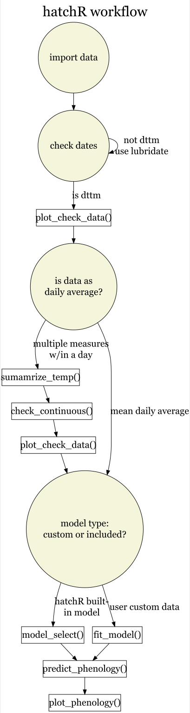

```{r, include=FALSE}
library(tidyverse)
library(hatchR)
```

# Abstract

Understanding the timing of key life history events is necessary for managing and conserving populations. Historically, models to predict hatch and emergence timing for fishes were difficult to employ in wild settings because average incubation temperature was needed as the primary parameter in predictive models. However, recent improvements to these techniques reworked models such that they could be applied in wild environments as long as users had data for when adult fish spawned and a record of average daily temperature over the course of development. Despite these improvements, their application remains limited due to few parameterizations for different species, being largely limited to salmonids. Here we present `hatchR`, a software ecosystem that allows users to predict hatch and emergence timing for wild fishes, as well as additional tools to aid in those analyses. `hatchR` allows users to leverage popular historic parameterizations for phenological models or to easily implement custom parameterizations using data not included in the package. `hatchR` is also distributed in two forms—an open source R package for maximum customization, as well as an HTML graphical-user-interface web application for individuals not familiar with scripting languages. To demonstrate potential uses, we present two case studies as likely applications for this software. `hatchR` promises to open many exciting avenues in research and management of fishes during their early life history.

# Introduction

As primarily poikilothermic organisms, the development and growth of fishes is tightly linked with the temperature of their ambient environment. This close relationship has allowed researchers to generate statistical models that allow the prediction of developmental phenology with high accuracy and precision. These models were typically developed in aquaculture settings and their initial formulations were not applicable to wild populations because they assumed a constant temperature over the course of development @beacham1990 (**add more!**) . However, @sparks2019 reformulated this approach as an "Effective Value model", in which the input was daily average temperature after a parent spawned and fish would either hatch or emerge when effective values cumulatively summed to one.

The resulting effective value approach has now been widely applied in salmonids for which parameterizations from aquaculture were readily available—for example Pacific Salmon (*Oncorhynchus spp.*) models developed by @beacham1990 were have been applied to various species and populaions [@adelfio2024; @adelfio2019; @kaylor2021] while models developed for Bull Trout (*Salvelinus confluentus*) by @mcphail1979 were extended by @austin2019. Despite growing popularity, applications have been largely limited within Salmonids, presumably because parameterizations for such models already existed due to their wide use in aquaculture and their general popularity as sport and commercial fish.

To bridge the gap between the application of one-off effective value model applications within individual studies and the lack of parameterization for other species, we developed the software ecosystem, `hatchR`. Specifically, `hatchR` allows users to input standard raw or summarized temperature datasets that are commonly collected in wild settings, run basic checks on those data, use built-in parameterizations like those from @beacham1990 or @sparks2017, develop custom models from their own temperature and phenological data, and predict hatch and emergence timing using these models in the effective value framework.

To widen the user application of these methods, we distribute two user-interfaces for `hatchR`. The first is a R package distributed via CRAN that allows users the most customizable application of these methods. The R package is especially powerful as it allows users to automate their analyses over multiple variables such as phenology type, multiple spawn dates, or different habitats with varying thermal regimes. These variable approaches are outlined in the package documentation on `hatchR`'s website. Alternatively, we also distribute a Shiny application in the form of an HTML-based web tool to interact with many of `hatchR`'s functions in a graphical-user-interface. The Shiny form trades-off some of automative power for user simplicity, while still allowing users to leverage much of the functionality of `hatchR`'s R package. Below, we present the basic overview of the software and multiple case studies of how it may be applied.

# Package Overview

`hatchR` is meant to primarily be a tool for predicting phenology. In this sense, we mostly limit functionality to these applications and provide minimal data checking and plotting help. This decision is in part driven by the diversity of data types that users may import and the difficulty in addressing all those data types with respect to various data checks. In other words, we expect users to know their data better than we do and to check it accordingly. We do provide two basic data check functions discussed in the Checking Data section. Similarly, we provide limited functionality for plotting results, but provide examples of how to build custom visualization from output, specifically in R. For the Shiny application, we provide a base output plot, but the ability to download your results for custom plotting in programs of the user's choice.

```{r echo = FALSE, out.height = '50%', fig.align = 'center'}

```


## Effective value models

Effective value models were created by @sparks2019 to implement developmental models in wild environments for Sockeye Salmon (*O. nerka*). The need for change arose because historic models, specifically those in @beacham1990, only considered the average incubation temperature during development and, for wild fishes, average incubation temperature was impossible to estimate because it was unknown when fish hatched even if adult spawn timing was known. To address this, @sparks2019 used the reciprocal of the formulation of model 2 from @beacham1990 and assigned an effective value for every day of development using the daily average temperature.

The model follows the general format of:

$$
Effective Value_i = 1/exp(log_ea - log_e(Temperature_i - b))
$$

Where *i* is the daily value and a fish hatches or emerges when the cumulative sum or $$\sum_{i =1}^nEffectiveValue_i = 1$$

The effective value model framework is the basis for the phenological models in `hatchR`, both in the included `model_table` in the package, as well as for custom models users can fit with `fit_model()`. Specifically, `model_table` has been extended to include more parameterizations from @beacham1990, @sparks2017, and @austin2019 (who extended @mcphail1979).

## Data format

## Checking Data

`hatchR` is built assuming data will be analyzed as daily average temperatures. Despite that assumption, raw data (*e.g.*, as outputted by HOBO loggers) can be used and `hatchR` includes functionality to summarize those data into a format that is usable, as well as provides functions for basic visual and programmatic data checks to make sure outliers or missing data are at least brought to users' attention.

summarize_temp, check_continuous and plot_check_temp

## Model Selection

talk about using nls for fit_model

model_table and fit_model

fit_model for three non-salmonid species

```{r, eval=FALSE}
smallmouth <- matrix(NA, 10, 2) |> tibble()
colnames(smallmouth) <- c("hours", "temp_F")
smallmouth$hours <- c(52, 54, 70, 78, 90, 98, 150, 167, 238, 234)
smallmouth$temp_F <- c(77, 75, 71, 70, 67, 65, 60, 59, 55, 55)

smallmouth <- smallmouth |> 
  mutate(days = ceiling(hours/24),
         temp_C = (temp_F -32) * (5/9))

plot(smallmouth$days~smallmouth$temp_C)

smb_mod <- fit_model(smallmouth,
                     temp = smallmouth$temp_C,
                     days = smallmouth$hours)

```

## Predicting Phenology and Output

Use woody \_example from website

show predict_phenology output slots

show plot_phenology

# Case Study 1

A common management scenario where developmental phenology might be useful would be trying to understand if fish might be free-moving before some management action. For instance, will have fish have emerged from redds when a stream section has been opened to grazing or bridge decommissioning will commence?

In this scenario, we will consider the grazing example and Bull Trout, a threatened fish in the united states under the Endangered Species Act [@nolfi2024], and the East Fork Salmon River, a key Bull Trout population in the upper Salmon River watershed. The fisheries manager there wants to know if fish will likely be out of the gravel and free-swimming by June 1st. In this system, it is expected that Bull Trout will be done spawning by the end of September, so we'll consider the last possible spawn date as September 30th.

```{r}

### read in EFS data

EFS_data <- crooked_river

### view bull trout models and select model

model_table |> 
  filter(species == "bull trout")

# we care about when fish are out of gravel, so select emerge mod
bt_emerge_mod <- model_select(author = "Austin et al. 2017",
                            species = "bull trout",
                            model = "MM",
                            dev.type = "emerge")

# predict emergence time using Sept. 30 as the spawn date 
bt_emergence <- predict_phenology(data = EFS_data,
                                  dates = date,
                                  temperature = temp_c,
                                  spawn.date = "2011-09-30", 
                                  model = bt_emerge_mod)

# fish emerge May 1, before June 1
bt_emergence$dev.period$stop


```

In this example we expect the last fish out of the gravel well before the June 1st date and the manager could allow grazing in this area without worrying about direct mechanical disturbance to fish developing in the gravel.

# Case Study 2

# Discussion

talk about how these models also represent local adaptation and heritable plasticity

talk about how these models represent point estimates and that emergence and hatch will take the form of a distribution

# Acknowledgements

We would like to sincerely thank the editor and reviewers for all of their helpful feedback which greatly improved both the software and the manuscript.

The views expressed in this manuscript are those of the authors and do not necessarily represent the views or policies of USFS or USFWS. Any mention of trade names, products, or services does not imply an endorsement by the U.S. government, USFS, or USFWS. USFS and USFWS do not endorse any commercial products, services or enterprises.

# References
