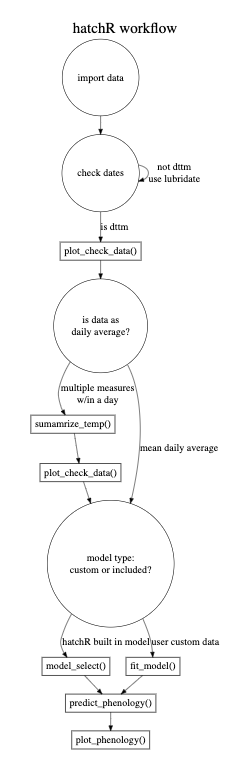

```{r setup, include = FALSE}
# rmd style
knitr::opts_chunk$set(
  collapse = TRUE,
  comment = "#>", 
  warning = FALSE,
  message = FALSE,
  fig.align = 'center',
  fig.width = 6
)

# load packages
library(hatchR)
library(lubridate)
library(readr)
library(dplyr)
library(nycflights13)
library(tibble)
library(ggplot2)
```

# Overview

`hatchR` is an R package that allows users to predict hatch and emergence timing for wild fishes, as well as additional tools to aid in those analyses. `hatchR` is intended to bridge the analytic gap of taking statistical models developed in hatchery settings [e.g., @beacham1990] and applying them to real world temperature data sets using the effective value framework developed by @sparks2019. 

This vignette:

* describes input data requirements, 
* provides recommendations for importing data, 
* explains basic data checks,  
* provides an overview of downstream steps in a `hatchR` workflow that are covered in other vignettes. 

## Input Data

Water temperature datasets found in the wild are often either (1) already summarized by day (i.e., mean daily temperature) or, 2) in a raw format from something like a HOBO TidbiT data logger where readings are taken multiple times per day, which can be summarized into a mean daily temperatures. Alternatively, daily water temperature predictions from novel statistical models [e.g., @siegel2023] could be similarly implemented.

Fundamentally, `hatchR` assumes you have input data with two columns: a date column, giving the date (and often time) of a temperature measurement, and a temperature column, giving the associated temperature measurement (in centigrade). Other columns are okay to include, but these two columns (with any column name---just *without* spaces) are required. We expect your data to look something like this:

| date       | temperature |
|------------|-------------|
| 2000-01-01 | 2.51        |
| ...        | ...         |
| 2000-07-01 | 16.32       |
| ...        | ...         |
| 2000-12-31 | 3.13        |


`hatchR` assumes you've checked for missing records or errors in your data as it can not function with gaps, so it's important to go through the data checks discussed below, as well as your own sanity checks.

`hatchR` can use values down to freezing (e.g, 0 °C), which returns extremely small effective values, and time to hatch or emerge may be \> 1 year. In these cases, we suggest users consider how much of that data type is reasonable with their data. 

### Prerequisites: Dates and Times {#prereqs}

Numeric temperature values are simple to work with in R, but dates and time can be tricky. Here we provide a brief overview of how to work with dates and times in R, but refer the user to [Chapter 17](https://r4ds.hadley.nz/datetimes.html) in R4DS [@wickham_r_2023] for a more in-depth discussion.

The [`lubridate`](https://lubridate.tidyverse.org/) package makes it easier to work with dates and times in R, comes installed with `hatchR`, and can be loaded with:

```{r, eval = FALSE}
library(lubridate)
```

There are three types of date/time data that refer to an instant in time:

* A **date**, which Tibbles print as \<date\>
* A **time** within a day, which Tibbles print as \<time\>
* A **date-time** is a date plus time, which Tibbles print as \<dttm\>. Base R calls these POSIXct, but that's not a helpful name. 

You can use `today()` or `now()` from `lubridate` to get the current date or date-time:
```{r}
today()
now()
```

In the context of `hatchR`, the ways you are likely to create a date/time are:

1. reading a file into R with `readr::read_csv()`
2. from a string (e.g., if data was read into R with `read.csv()`)
3. from individual components (year, month, day, hour, minute, second)

#### Reading in dates from a file

When reading in a CSV file with `readr::read_csv()`, `readr` (which also comes installed with `hatchR`) will automatically parse (recognize) dates and date-times if they are in the form "YYYY-MM-DD" or "YYYY-MM-DD HH:MM:SS". These are ISO8601 date (\<date\>) and date-time (\<dttm\>) formats, respectively. ISO8601 is an international standard for writing dates where the components of a date are organized from biggest to smallest separated by -. Below, we first load the `readr` package and then read in a CSV file with dates in the form "YYYY-MM-DD" and "YYYY-MM-DD HH:MM:SS":

```{r, eval=FALSE}
library(readr)
```

```{r}
csv <- "
  date,datetime
  2022-01-02,2022-01-02 05:12
"
read_csv(csv)
```

If your dates are in a different format, you’ll need to use `col_types` plus `col_date()` or `col_datetime()` along with a standard date-time format (see [Table 17.1](https://r4ds.hadley.nz/datetimes.html#tbl-date-formats) in R4DS for a list of all date format options). 

#### From strings

If you you read in a CSV file using `read.csv()` from base R, date columns will be formatted as a characters (\<char\>; e.g., `"2000-09-01"` or `"2000-09-01 12:00:00"`). You will have convert to this column to a \<date\> or \<dttm\>. lubridate’s helpers attempt to automatically determine the format once you specify the order of the component. To use them, identify the order in which year, month, and day appear in your dates, then arrange “y”, “m”, and “d” in the same order. That gives you the name of the `lubridate` function that will parse your date. For date-time, add an underscore and one or more of “h”, “m”, and “s” to the name of the parsing function. 

```{r}
ymd("2017-01-31")
mdy("January 31st, 2017")
dmy("31-Jan-2017")
ymd_hms("2017-01-31 20:11:59")
mdy_hm("01/31/2017 08:01")
```

#### From individual components

Sometimes you have the components of a date in separate columns. You can use `make_date()` or `make_datetime()` to combine them into a date or date-time. 

To show this, we'll use the `flights` dataset that comes with `nycflights13`, which is only installed alongside `hatchR` when `dependencies = TRUE` in `install.packages()`. We also make use of helper functions from dplyr to select and mutate columns.

```{r, eval=FALSE}
library(nycflights13)
library(dplyr)
```

```{r}
flights |> 
  select(year, month, day, hour, minute)

flights |> 
  select(year, month, day) |>
  mutate(date = make_date(year, month, day))

flights |> 
  select(year, month, day, hour, minute) |> 
  mutate(departure = make_datetime(year, month, day, hour, minute))
```


# Importing your data {#data-in}

Because `hatchR` uses daily water temperature records to predict fish developmental phenology, we enforce a (\<date\>) class for date fields. 

## Using `readr::read_csv()`

As noted in [the prerequisites section]{#prereqs}, we recommend loading your data into R using `readr::read_csv()`. We can load readr using:

```{r, eval=FALSE}
library(readr)
```

In this and other vignettes, we will use two datasets that come installed with the package: `crooked_river` and `woody_island`. Each dataset is available to the user as R objects once `hatchR` is installed and attached (see `?crooked_river` or `?woody_island` for more information). The raw example data (.csv files) are stored in the `extdata/` directory installed alongside `hatchR`. We may store the file paths to example data:

```{r}
path_cr <- system.file("extdata/crooked_river.csv", package = "hatchR")
path_wi <- system.file("extdata/woody_island.csv", package = "hatchR")
```


After specifying `path_*` (using `system.file()`), we load the example dataset into R:

```{r}
crooked_river <- read_csv(path_cr)
woody_island <- read_csv(path_wi)
```

We check the `crooked_river` dataset by running either `str()` or `tibble::glimpse()` to see the structure of the data. `glimpse()` is a little like `str()` applied to a data frame, but it tries to show you as much data as possible. We prefer `tibble::glimpse()` because it is more compact and easier to read. `tibble` also comes installed with `hatchR`. 

```{r, eval=FALSE}
library(tibble)
```

Now we can check the structure of the `crooked_river` dataset:

```{r}
glimpse(crooked_river)
glimpse(woody_island)
```

For your own data, assuming you have a .csv file in a `data` folder in your working directory called `your_data.csv`, you would call:

```{r, eval=FALSE}
library(readr)
library(tibble)
your_data <- read_csv("data/your_data.csv")
glimpse(your_data)
```

## Using `read.csv()`

If you import your data in with functions like `read.csv()` or `read.table()`, date columns will be formatted as a characters (\<chr\>). You will have convert to this column to a \<date\> or \<dttm\> type, and we recommend you do this using [\`lubridate\`](https://lubridate.tidyverse.org/), which makes dealing with date a litter easier. Here is an example of how you might do this:

```{r}
crooked_river <- read.csv(path_cr)
woody_island <- read.csv(path_wi)

str(crooked_river) # note date column is imported as a character (<chr>)
str(woody_island) # note date column is imported as a character (<chr>)

# convert using lubridate functions ------

# if your date is in the form "2000-09-01 12:00:00"
crooked_river$date <- lubridate::ymd_hms(crooked_river$date)

# if your date is in the form "2000-09-01"
woody_island$date <- lubridate::mdy(woody_island$date) 

# check
glimpse(crooked_river)
glimpse(woody_island)
```


# Data Checks

After data are loaded and dates are formatted correctly, we can complete a series of checks to ensure that the temperature data is in the correct format and that there are no missing values. 

`hatchR` provides a series of functions to help with this process. 
```{r, eval = FALSE}
library(hatchR)
```


## Vizualize your data

It is best practice to visualize your data. To aid users, `hatchR` comes with wrapper function `plot_check_temp()` to visualize your imported data and verify nothing strange happened during your import process. The function outputs a `ggplot2` object which can be subsequently modified by the user. The arguments `temp_min =` and `temp_max =` can be used to custom set thresholds for expected temperature ranges (defaults are set at 0 and 25 C). Here is an example using the built-in dataset `crooked_river`:

```{r}
plot_check_temp(data = crooked_river, 
                dates = date, 
                temperature = temp_c, 
                temp_min = 0, 
                temp_max = 12)
```


## Summarize Data

If you imported raw data with multiple recordings per day, `hatchR` has a built in function to summarize those data to a daily average mean called `summarize_temp()`. The output of the function is a tibble with mean daily temperature and its corresponding day.

```{r}
# create date object for a year with 30 min temperature measurement intervals
dates <- seq(
  from = ymd_hms("2000-01-01 00:00:00"),
  to = ymd_hms("2000-12-31 23:59:59"), 
  length.out = 17568
  ) 

# create empty dataframe
temp.test <- data.frame(matrix(NA, nrow = length(dates), ncol = 1)) 
colnames(temp.test)[1] <- "date" # date column

# add dates vector to date columns
temp.test[1] <- dates 

set.seed(123)

# simulate temps from a random normal dist with mean 10 sd 3 for every date time combo in dates and append to column (temp) in temp.test
temp.test$temp <- rnorm(n = length(dates), mean = 10, sd = 3) |> abs() 

glimpse(temp.test) # info about temp.test

# check how many rows in raw data
nrow(temp.test) #17568 records

# summarized data
temp.test_sum <- summarize_temp(data = temp.test,
                                temperature = temp,
                                dates = date)

nrow(temp.test_sum) #365 records
```

We again recommend, at a minimum, visually checking your data once it has been summarized.

```{r}
# note we are now using crooked_river_sum instead of crooked_river
plot_check_temp(data = temp.test_sum, 
                dates = date, 
                temperature = daily_temp, 
                temp_min = 5,
                temp_max = 15)
```


## Check for continuous data

At present, `hatchR` only uses continuous data. Therefore, your data is expected to be continuous and complete.  

You can check whether your data is complete and continuous using the `check_continuous()` function. This function will return a message if the data is not continuous or complete. 

```{r, warning=TRUE, message=TRUE}
check_continuous(data = crooked_river, dates = date)
```

If you have days of missing data, you could impute them using rolling means or other approaches. 

# Workflow

After importing, wrangling, and checking your temperature data, there are a number of different actions you can take.  These steps are laid out in subsequent vignettes: [Parameterize hatchR models](https://bmait101.github.io/hatchR/articles/Parameterize_models.html), [Predict phenology: basic](https://bmait101.github.io/hatchR/articles/Predict_phenology_basic.html), [Predict phenology: advanced](https://bmait101.github.io/hatchR/articles/Predict_phenology_advanced.html), [Predict phenology: nested](https://bmait101.github.io/hatchR/articles/Predict_phenology_nested.html), and [Advanced plotting](https://bmait101.github.io/hatchR/articles/Advanced_plotting.html).

The generalized workflow for `hatchR`, including the above and subsequent steps, is shown below.

```{r echo = FALSE, out.width = '50%'}

```


# References {.unnumbered}


